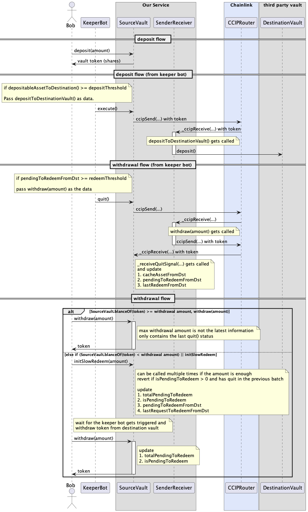

# warp

ETHGlobal London Hackathon Project

## Screenshot

## Deployed Contracts

### Source Vault
Deployed to [Base Sepolia](https://sepolia.basescan.org/address/0x6fd4f4e2bd64168254f3c719b28b88d5d0246d40#code). This is the user facing ERC4626 contract that handles deposits and initiates cross chain transactions to deposit and withdraw from the destination vault.

### SenderReceiver
Deployed to [Arbitrum Sepolia](https://sepolia.arbiscan.io/address/0x59d4f2d53612e944c583c838358f4310c5136799#code). This is contract on the destination chain that receives CCIP messages, interacts with the destination ERC4626, and handles all of the accounting for user deposits.

## Deposit / Withdrawal Flow

## Caveat

1. If a user deposit a huge N amount and we haven’t bridge to destination chain, this user can initialSlowWithdraw to try to move N amount back to source chain. This might be an minor attack way if someone wants to waste the gas fee of our vaults. This can also make our destination chain’s contract withdraw more than we deposited.
2. There will be an accounting issue when `quit` and `execute` are sending at the same time. Because `cacheAssetFromDst` gets overridden, but that data is not up to date. This can be solved by introducing lock mechanism (lock the deposit / withdrawal while doing `quit` and `execute`).
3. There’s an potential arbitrage opportunity. It depends on the synchronous frequency of source and destination vault. Users can deposit and withdraw the fund before and after the quit. This can be solved by introducing lock mechanism (at least to deposit for several blocks).
